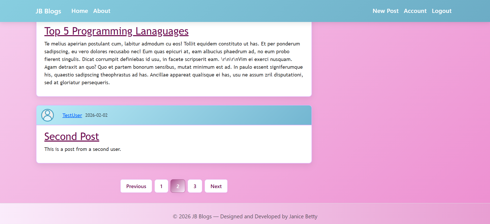
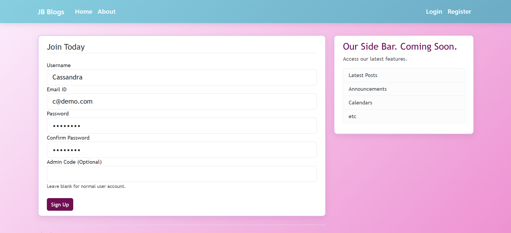
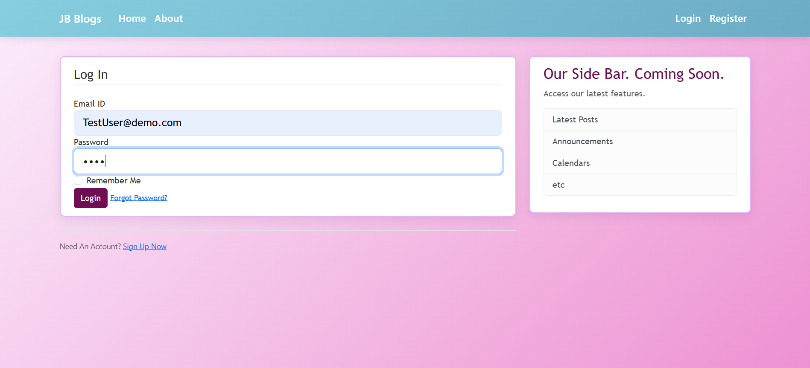
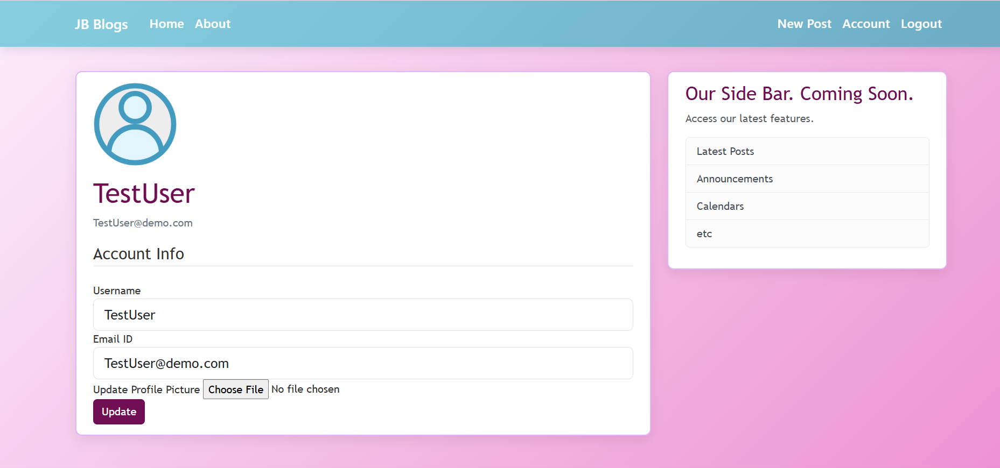
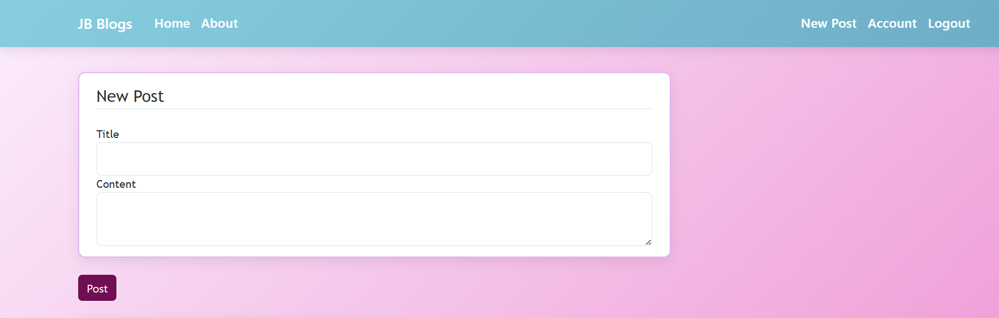

# Project Title
Blog Management System with Flask & PostgreSQL

## 🚀 Live Demo
[View Live Application](https://blog-management-system-f388.onrender.com)

## 📌 Overview
A production-ready, role-based blog management system built with Flask, where administrators have full control over creating, updating, and deleting posts while users can securely view published content. The application uses SQLAlchemy for database handling in development and PostgreSQL in production for scalable deployment.

## 📸 Application Preview

### 🏠 Home Page – Blog Listing

<p align="center">
  
</p>

### 📝 User Registration

<p align="center">
  
</p>

### 🔐 User Login

<p align="center">
  
</p>

### 👤 Account Management

<p align="center">
  
</p>

### ✍️ Create Post (Admin Access)

<p align="center">
  
</p>

## 🧠 Problem Statement
Many small teams and content platforms require a simple and secure way to publish and manage blog content without giving full editing privileges to all users. Public blogging systems often lack proper role-based access control, which can lead to unauthorized modifications or poor content governance.

This project aims to design a structured blog management system where only administrators have permission to create, edit, and delete posts, ensuring controlled content publishing while allowing users to freely view published articles.

## 🛠 Tech Stack
- Python / Flask
- SQLAlchemy / SQLite / PostgreSQL
- Jinja2
- Bootstrap
- Gunicorn
- GitHub
- Render

## ✨ Features
- Secure authentication using Flask-Login with Bcrypt password hashing
- Role-based access control (Admin/User) with protected routes
- Full CRUD functionality for blog posts with dynamic routing
- Pagination for efficient post browsing
- Profile management with image upload support
- Modular architecture using Flask Blueprints
- SQLite for development and PostgreSQL for production deployment

## ⚙️ Installation (Run Locally)

```bash
git clone https://github.com/JaniceBetty/Blog-Management-System
cd Blog-Management-System

# Create virtual environment
python -m venv venv
venv\Scripts\activate  # On Windows

pip install -r requirements.txt

# Copy environment template
copy .env.example .env   # Windows
# OR
cp .env.example .env     # Mac/Linux

python run.py
```

## 📂 Project Structure
```text
Blog-Management-System/
│
├── flask_blog/
│   ├── main/              # General routes (home, landing pages)
│   ├── posts/             # Blog post CRUD functionality
│   ├── users/             # Authentication and profile management
│   ├── templates/         # Jinja2 templates
│   ├── static/            # CSS, images, uploaded files
│   ├── __init__.py        # Application factory & Blueprint registration
│   ├── config.py          # Configuration classes
│   └── models.py          # Database models
│
├── run.py                 # Application entry point
├── requirements.txt       # Project dependencies
├── .env.example           # Template for environment variables
└── .gitignore             # Git ignored files
```
The project follows a modular architecture using Flask Blueprints to ensure scalability, separation of concerns, and maintainability.

## 🚀 Deployment
- Hosted on Render
- Production database: PostgreSQL
- Environment variables configured securely

## 📈 Future Improvements
- Implement JWT-based authentication for stateless API access  
- Refactor fully into the Flask Application Factory pattern  
- Enhance configuration management with environment-based settings (Development, Testing, Production)  
- Introduce automated testing  
- Containerize the application using Docker  

## 👩‍💻 Author
Janice Betty
